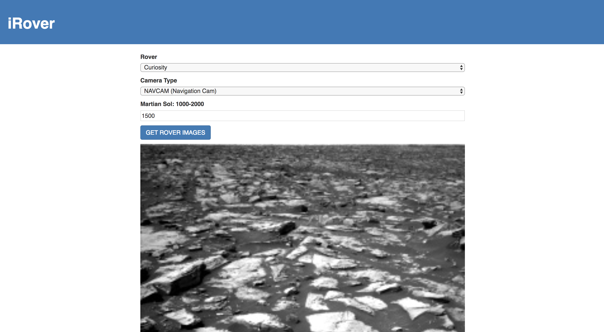

# iRover App

iRover is a fun, simple app built with ReactJS that pulls from the NASA API and returns images from the mars rover based on type, camera angle and solstice.

## Screenshot


## Learning

This app was built in an effort to become more familiar with ReactJS and to experiment with the NASA API.

## Built With

* [React](https://github.com/facebookincubator/create-react-app) - Front-End web application framework
* [NASA API](https://api.nasa.gov/) - NASA API

## Installation
```
git clone https://github.com/ReggEvans/simple-nasa-app.git
cd simple-nasa-app
npm install
npm start

open localhost:3000 in the browser

* Project Requires an API key from the NASA API

## License
This project is licensed under the MIT License.
